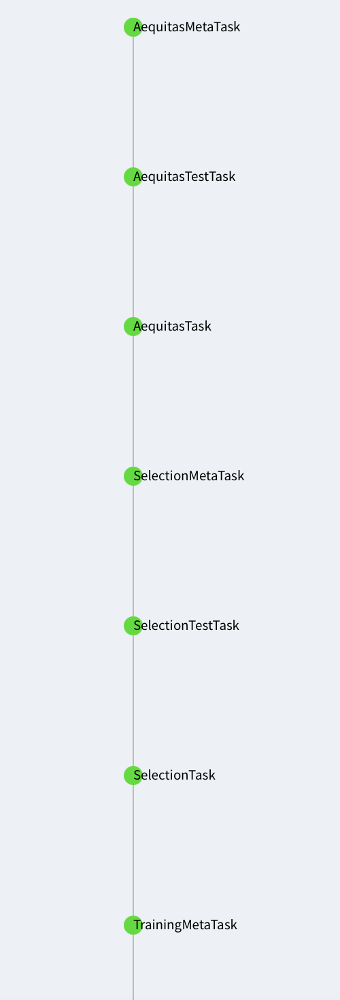
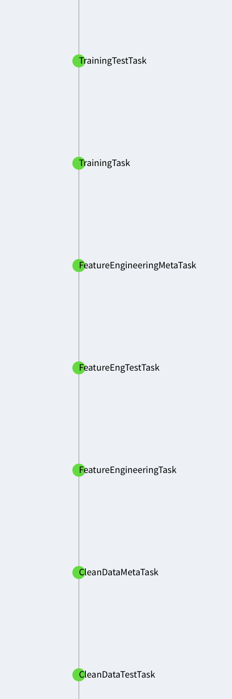
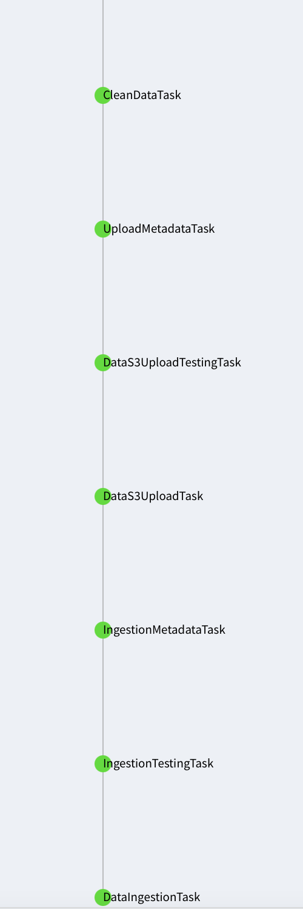
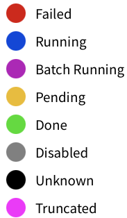

# Clasificación de inspecciones realizadas a establecimientos de comida en la ciudad de Chicago.

Un proyecto de punta a punta realizado en la materia de _Data Product Architecture_. 

## Contenidos

1. [Proyecto](#proyecto)
   1. [Integrantes del equipo](#integrantes-del-equipo)
   1. [Descripción de los datos](#descripción-de-los-datos)
   1. [Pregunta analítica a contestar](#pregunta-analítica-a-contestar-con-el-modelo)
   1. [Frecuencia de actualización de los datos](#frecuencia-de-actualización-de-los-datos)
1. [Configuración](#configuración)
   1. [Python y requerimientos](#python-y-requerimientos)
   1. [Notebooks](#notebooks)
   1. [Credenciales](#credenciales)
   1. [Constantes](#constantes)
   1. [Base de datos](#base-de-datos)
1. [Estructura del proyecto](#estructura-del-proyecto)
1. [Orquestación](#orquestación)
   1. [Ejemplo: Metadatos de aequitas con datos históricos](#ejemplo-metadatos-de-aequitas-con-datos-históricos-al-día-de-hoy)
   1. [Ejemplo: Metadatos de aequitas con ingesta continua](#ejemplo-metadatos-de-aequitas-con-ingesta-continua-de-la-semana-anterior-al-20-de-abril-de-2021)
1. [Pruebas Unitarias](#pruebas-unitarias)
   1. [Ingesta](#ingesta)
   1. [Almacenamiento](#almacenamiento)
   1. [Limpieza](#limpieza)
   1. [Feature Engineering](#feature-engineering)
   1. [Entrenamiento](#entrenamiento)
   1. [Selección](#selección)
   1. [Sesgo e inequidad](#sesgo-e-inequidad)
1. [Análisis de sesgo e inequidad](#análisis-de-sesgo-e-inequidad)
1. [Proceso de ingesta manual](#proceso-de-ingesta-manual)
   1. [Ingesta histórica](#ingesta-histórica)
   1. [Ingesta consecutiva](#ingesta-consecutiva)
   1. [Uso de datos almacenados en S3](#uso-de-datos-almacenados-en-s3)
   
## Proyecto

### Integrantes del equipo:

* [José Antonio Lechuga Rivera](https://github.com/lechugaa)
* [Carlos Bautista](https://github.com/cbautistap)
* [Mario Arturo Heredia Trejo](https://github.com/mhnk77)
* [Enrique Ortiz Casillas](https://github.com/EnriqueOrtiz27)


### Descripción de los datos

La base de datos con la que trabajamos contiene información respecto a las inspecciones 
a restaurantes y a otros establecimientos de comida en la ciudad de Chicago del primero
de enero de 2010 a la fecha actual. (Los datos se encuentran en [este link](https://data.cityofchicago.org/Health-Human-Services/Food-Inspections/4ijn-s7e5))

**Información general de la base de datos:** 

* 215,000 renglones (cada fila es una inspección realizada)
* 17 columnas

Las columnas contienen información acerca del establecimiento inspeccionado así como del
resultado de la inspección. Las siguientes son algunas de las variables disponibles en el
conjunto de datos:

* Nombre del establecimiento inspeccionado
* Número de licencia del establecimiento
* Tipo de establecimiento
* Riesgo de la categoría del establecimiento
* Dirección del establecimiento
* Fecha de la inspección
* Tipo de inspección
* Resultados
* Violaciones al reglamento


### Pregunta analítica a contestar con el modelo.

La pregunta a contestar es la siguiente: 

_Dadas las características de este establecimiento, ¿pasará o no pasará la inspección?_

Es decir, este es un problema de clasificación en donde intentaremos determinar, a partir de 
características generales de un establecimiento, si podrá o no cumplir con los estándares de salubridad
requeridos para pasar una inspección.

### Frecuencia de actualización de los datos.

Los datos se actualizan diariamente. Sin embargo, los _pipelines_ de este proyecto corren de forma
semanal.

## Configuración

### Python y requerimientos

Este proyecto está programado y probado usando python 3.7.4. En el directorio raíz se encuentra
un archivo llamado `requirements.txt` que contiene todas las dependencias necesarias para ejecutar
satisfactoriamente el proyecto. Para instalarlas usar el siguiente comando:

```
pip install -r requirements.txt
```

### Notebooks

Para poder correr los Jupyter notebooks se debe adicionar el csv de datos de inspecciones de la 
ciudad de Chicago con el nombre `Food_Inspections.csv` dentro del directorio `data`.

### Credenciales

Para conectarse programáticamente a AWS y a la API del set de datos debe de existir un archivo de configuraciones en 
la ruta `conf/local/credentials.yaml`. La estructura del este archivo debe ser la siguiente:

```
---
s3:
  aws_access_key_id: SU_AWS_ACCESS_KEY_ID
  aws_secret_access_key: SU_AWS_SECRET_ACCESS_KEY

food_inspections:
  api_token: SU_APP_TOKEN_DE_CHICAGO_API
  
data_base:
   user: USUARIO
   password: PASSWORD
   database: NOMBRE_DE_BASE_DE_DATOS
   host: IP_DE_INSTANCIA_DE_BASE_DE_DATOS_EN_AWS
   port: PUERTO
...
```

### Constantes

Para poder ejecutar el proyecto satisfactoriamente, es importante personalizar algunas de las constantes que se usan
a lo largo del pipeline y que se encuentran en `src.utils.constants.py`. Las que se deben modificar se enlistan a 
continuación:

* `bucket_name`: esta debe ser modificada por el nombre de un bucket de S3 al que usted tenga acceso desde las 
  credenciales de AWS que configuro en el paso anterior.
  
### Base de datos

Para poder ejecutar las secciones del proyecto que requieren de una base de datos postgres en AWS es importante 
que exista la base de datos que añadió en `conf/local/credentials.yaml` para con nombre `NOMBRE_DE_BASE_DE_DATOS`.

En `sql/create_metadata_tables.sql` se encuentra el código de SQL necesario para crear el esquema en la base de datos
configurada en caso de ser necesario. No obstante, se recomienda, dejar que Luigi lo realice por sí solo para evitar
pasos adicionales de configuración. Para que esto suceda automáticamente, al correr el orquestador, es necesario
que la base de datos del archivo de credenciales exista y que se hayan agregado correctamente los elementos de conexión
a este mismo archivo.

## Estructura del proyecto

Esta es la estructura del proyecto incluyendo notebook del EDA llamado `eda.ipynb`.

```
├── README.md                                         <- The top-level README for developers using this project.
├── conf
│   ├── base                                          <- Space for shared configurations like parameters
│   └── local                                         <- Space for local configurations, usually credentials
│       └── credentials.yaml                          <- Required credentials for connecting to AWS
├── data                                              <- Space for temporary csv files required for testing and EDA
│
├── docs                                              <- Space for Sphinx documentation
│
│
├── img                                               <- Images used for README.md
├── notebooks                                         <- Jupyter notebooks.
│   ├── legacy                                        <- Jupyter notebook drafts
│   ├── shapefiles                                    <- Shapefiles and geojson required for graphing purposes
│   ├── modeling                                      <- Jupyer notebooks used for cleaning, feature engineering and modeling drafts
│   └── eda.ipynb                                     <- Iniital EDA and GEDA for project
│   
├── references                                        <- Data dictionaries, manuals, and all other explanatory materials.
│
├── results                                           <- Intermediate analysis as HTML, PDF, LaTeX, etc.
│
├── requirements.txt                                  <- The requirements file
│
├── .gitignore                                        <- Avoids uploading data, credentials, outputs, system files etc
│
├── infrastructure
├── sql                                               <- SQL scripts for generating database tables required for project
├── setup.py
├── temp                                              <- Temporal storage for general use in the project
└── src                                               <- Source code for use in this project.
    ├── __init__.py                                   <- Makes src a Python module
    │
    ├── utils                                         <- Functions used across the project
    │   ├── general.py                                <- Obtención de credenciales de AWS
    │   └── constants.py                              <- Definición de constantes del proyecto
    ├── etl                                           <- Scripts to transform data from raw to intermediate states
    │
    │
    ├── pipeline
    │    ├── ingesta_almacenamiento.py                <- ingesta datos desde API y almacenamiento en S3
    │    ├── limpieza_feature_engineering.py          <- limpieza y generación de features de modelo
    │    ├── deprecated_funs.py                       <- funciones que probablemente no se necesiten
    │    ├── bias_fairness.py                         <- funcionalidad de limpieza e inequidad
    │    └── modelling.py                             <- entrenamiento y selección de modelo
    │
    │
    ├── tests
    │    ├── ingestion_tests.py                       <- pruebas unitarias para ingestión
    │    ├── upload_tests.py                          <- pruebas unitarias para almacenamiento
    │    ├── clean_data_tests.py                      <- pruebas unitarias para limpieza y preprocesamiento
    │    ├── feature_eng_tests.py                     <- pruebas unitarias para feature engineering
    │    ├── training_tests.py                        <- pruebas unitarias para entrenamiento
    │    ├── selection_tests.py                       <- pruebas unitarias para selección de modelo
    │    └── aequitas_tests.py                        <- pruebas unitarias para sesgo e inequidad
    │
    │
    └── orchestration                                 <- Luigi task definitions used across the project
         ├── data_ingestion_task.py                   <- Luigi task for data ingestion
         ├── ingestion_testing_task.py                <- Luigi task for data ingestion unit tests
         ├── ingestion_metadata_task.py               <- Luigi task for data ingestion metadata
         ├── data_s3_upload_task.py                   <- Luigi task for data upload to S3
         ├── data_s3_upload_testing_task.py           <- Luigi task for data upload to S3 unit tests
         ├── data_s3_upload_metadata_task.py          <- Luigi task for data upload to S3 metadata
         ├── clean_data_task.py                       <- Luigi task for data cleaning
         ├── clean_data_test_task.py                  <- Luigi task for data cleaning unit tests
         ├── clean_data_metadata_task.py              <- Luigi task for data cleaning metadata
         ├── feature_engineering_task.py              <- Luigi task for feature engineering
         ├── feature_eng_test_task.py                 <- Luigi task for feature engineering unit tests
         ├── feature_engineering_metadata_task.py     <- Luigi task for feature engineering metadata
         ├── training_task.py                         <- Luigi task for training
         ├── training_test_task.py                    <- Luigi task for training unit tests
         ├── training_metadata_task.py                <- Luigi task for training metadata
         ├── selection_task.py                        <- Luigi task for model selection
         ├── selection_test_task.py                   <- Luigi task for model selection unit tests
         ├── selection_metadata_task.py               <- Luigi task for model selection metadata
         ├── aequitas_task.py                         <- Luigi task for bias and fairness
         ├── aequitas_test_task.py                    <- Luigi task for bias and fairness unit tests
         └── aequitas_metadata_task.py                <- Luigi task for bias and fairness metadata
```

## Orquestación

El proyecto actualmente cuenta con 21 tasks de orquestación. A continuación se muestra el DAG de Luigi:

 
 
 

Para ejecutar cualquiera de los siguientes tasks, una vez que se siguieron 
[las instrucciones de configuración](#configuración), se requiere introducir la siguiente línea de comandos:

```
PYTHONPATH='.' luigi --module src.orchestration.<NOMBRE_DE_SCRIPT> <NOMBRE_DE_CLASE> [--local-scheduler] [--historic] [--query-date <YYYY-MM-DD>]
```

* `--historic`: si se incluye este argumento se realizarán las tareas con los datos históricos, mientras que si se omite 
  se realizarán con los datos de la última semana (ingesta continua).
* `--query-date`: se debe agregar la fecha de ingesta deseada en formato YYYY-MM-DD. Si se omite este argumento, se
   utilizará la fecha del día de ejecución en el código.
* `--local-scheduler`: ejecuta las tareas de Luigi sin necesidad de iniciar un scheduler. Para omitirse es necesario
   estar corriendo un scheduler a través de comando `luigid` en otra consola.
  
La siguiente tabla se detallan todos los tasks del proyecto así como el `NOMBRE_DE_SCRIPT` y `NOMBRE_DE_CLASE` que 
se requieren para ejecutarlo.


| Etapa               | Tarea                                    | Script                              | Clase                        | Descripción                                                                      |
|:-------------------:|:----------------------------------------:|:-----------------------------------:|:----------------------------:|:--------------------------------------------------------------------------------:|
| Ingesta             | Ingesta                                  | `data_ingestion_task`               | `DataIngestionTask`          | Guardar localmente en formato pickle los datos solicitados de la API de Chicago. |
| Ingesta             | Pruebas unitarias de ingesta             | `ingestion_testing_task`            | `IngestionTesting`           | Realiza las pruebas unitarias de ingesta.                                        |
| Ingesta             | Metadatos de ingesta                     | `ingestion_metadata_task`           | `IngestionMetadataTask`      | Genera los metadatos de `DataIngestionTask`.                                     |
| Almacenamiento      | Almacenamiento                           | `data_s3_upload_task`               | `DataS3UploadTask`           | Sube a S3 la ingesta de datos obtenida en la `DataIngestionTask`.                |
| Almacenamiento      | Pruebas unitarias de almacenamiento      | `data_s3_upload_testing_task`       | `DataS3UploadTestingTask`    | Realiza las pruebas unitarias de almacenamiento.                                 |
| Almacenamiento      | Metadatos de almacenamiento              | `data_s3_upload_metadata_task`      | `UploadMetadataTask`         | Genera los metadatos de `DataS3UploadTask`.                                      |
| Limpieza            | Limpieza                                 | `clean_data_task`                   | `CleanDataTask`              | Realiza la limpieza de los datos guardados en `DataS3UploadTask`.                |
| Limpieza            | Pruebas unitarias de limpieza            | `clean_data_test_task`              | `CleanDataTestTask`          | Realiza las pruebas unitarias de limpieza.                                       |
| Limpieza            | Metadatos limpieza                       | `clean_data_metadata_task`          | `CleanDataMetaTask`          | Genera los metadatos de `CleanDataTask`.                                         |
| Feature engineering | Feature engineering                      | `feature_engineering_task`          | `FeatureEngineeringTask`     | Genera los features requeridos empleando los datos generados en `CleanDataTask`. |
| Feature engineering | Pruebas unitarias de feature engineering | `feature_eng_test_task`             | `FeatureEngTestTask`         | Realiza las pruebas unitarias de feature engineering.                            |
| Feature engineering | Metadatos de feature engineering         | `feature_engineering_metadata_task` | `FeatureEngineeringMetaTask` | Genera los metadatos de `FeatureEngineeringTask`.                                |
| Entrenamiento       | Entrenamiento                            | `training_task`                     | `TrainingTask`               | Realiza el entrenamiento de los modelos y los sube a S3.                         |
| Entrenamiento       | Pruebas unitarias de entrenamiento       | `training_test_task`                | `TrainingTestTask`           | Realiza las pruebas unitarias de entrenamiento.                                  |
| Entrenamiento       | Metadatos entrenamiento                  | `training_metadata_task `           | `TrainingMetaTask`           | Genera los metadatos de `TrainingTestTask`.                                      |
| Selección           | Selección                                | `selection_task`                    | `SelectionTask`              | A partir de los modelos entrenados selecciona el mejor basado en AUC.            |
| Selección           | Pruebas unitarias de selección           | `selection_test_task`               | `SelectionTestTask`          | Realiza las pruebas unitarias de selección                                       |
| Selección           | Metadatos de selección                   | `selection_metadata_task`           | `SelectionMetaTask`          | Genera los metadatos de `SelectionTask`.                                         |
| Sesgo e inequidad   | Sesgo e inequidad                        | `aequitas_task`                     | `AequitasTask`               | A partir del modelo seleccionado, genera las métricas de bias y fairness         |
| Sesgo e inequidad   | Pruebas unitarias de Sesgo e inequidad   | `aequitas_test_task`                | `AequitasTestTask`           | Realiza las pruebas unitarias de bias y fairness                                 |
| Sesgo e inequidad   | Metadatos de Sesgo e inequidad           | `aequitas_metadata_task`            | `AequitasMetaTask`           | Genera los metadatos de bias y fairness                                          |


Algunos ejemplos (adecuados para el checkpoint 6) son:

### Ejemplo: Metadatos de aequitas con datos históricos al día de *hoy*
```
PYTHONPATH='.' luigi ---module src.orchestration.aequitas_metadata_task AequitasMetaTask --local-scheduler --historic
```

### Ejemplo: Metadatos de aequitas con ingesta continua de la semana anterior al 20 de abril de 2021

```
PYTHONPATH='.' luigi --module src.orchestration.aequitas_metadata_task AequitasMetaTask --local-scheduler --query-date 2021-04-20
```

## Pruebas Unitarias

### Ingesta

Las pruebas unitarias de ingesta son las siguientes:

* `test_number_of_columns`: verifica el número de columnas en la ingesta
* `test_df_not_empty`: verifica que la ingesta no venga sin observaciones
* `test_df_columns`: verifica por nombre que se cuente con todas las variables esperadas

### Almacenamiento

Las pruebas unitarias de almacenamiento son las siguientes:

* `test_df_are_equal`: verifica que el contenido de la ingesta y del df almacenado en S3 sea idéntico renglón por renglón
y tipos de datos
  
### Limpieza

Las pruebas unitarias de limpieza son las siguientes:

* `test_df_smaller_equal`: verifica que el dataframe post limpieza no tenga más variables que el que proviene de almacenamiento
* `test_df_not_empty`: verifica que el dataframe no esté vacío
* `test_df_smaller_rows`: verifica que el dataframe post limpieza no tenga más observaciones que el que proviene de almacenamiento
* `test_df_columns`: verifica que las variables del df sean un subconjunto de las originales ingestadas
 
### Feature Engineering

Las pruebas unitarias de feature engineering son las siguientes:

* `test_df_not_empty`: verifica que los siguientes dataframes existan en S3:
  * x_train (en caso de activar el flag de `--training`)
  * y_train (en caso de activar el flag de `--training`)
  * x_test (en caso de activar el flag de `--training`)
  * y_test (en caso de activar el flag de `--training`)
  * self.X (en caso de no activar el flag de `--training`) lo que implica que se utilizará para predicción
  * self.y (en caso de no activar el flag de `--training`) lo que implica que se utilizará para predicción
  
### Entrenamiento

Las pruebas unitarias de entrenamiento son las siguientes:

* `test_enough_models`: verifica que después del proceso de entrenamiento existan al menos dos modelos.

*Nota:* si se solicita a la task de Luigi más de 2 modelos (por el momento) esta prueba unitaria falla, ya que 
nuestro proyecto aún no entrena más de dos. Un ejemplo de este caso sería el siguiente comando:

```
PYTHONPATH='.' luigi --module src.orchestration.training_metadata_task TrainingMetaTask --local-scheduler --desired-models 10
```

Para pruebas rápidas se recomienda no incluir el flag de `--historic` para que el entrenamiento sea más rápido.
Para producción es obligatorio incluirlo.

### Selección

Las pruebas unitarias de selección son las siguientes:

* `test_classes`: verifica que el modelo seleccionado tenga como output las clases 0 y 1, aunque se puede especificar
otras en caso de que esto cambie en el futuro a través del parámetro `--desired-classes`.
  
*Nota:* si se solicita cualquier combinación de clases que no sean 0 y 1, esta prueba unitaria fallará, ya que 
nuestros scripts de modelado están diseñados para solo generar esas dos etiquetas de predicción. Un ejemplo de este 
caso sería el siguiente comando:

```
PYTHONPATH='.' luigi --module src.orchestration.selection_metadata_task SelectionMetaTask --local-scheduler --desired-classes '[0, 1, 2]'
```

Para pruebas rápidas se recomienda no incluir el flag de `--historic` para que el entrenamiento sea más rápido.
Para producción es obligatorio incluirlo.

### Sesgo e inequidad

Las pruebas unitarias de sesgo e inequidad son las siguientes:

* `test_df_not_empty`: verifica que en verdad se estén generando las métricas de sesgo e inequidad al checar que no
estén vacíos los df.

* `test_number_of_categories`: verifica que existan al menos dos categorías de las variables de atributos protegidos.
Este comportamiento se puede modificar al usar el parámetro `--min-categories`

*Nota:* si se solicita un número de categorías mayor a las que existen naturalmente en los datos, esta prueba unitaria 
fallará. Un ejemplo de este caso sería el siguiente comando:

```
PYTHONPATH='.' luigi --module src.orchestration.aequitas_metadata_task AequitasMetaTask --min-categories 100
```

Para pruebas rápidas se recomienda no incluir el flag de `--historic` para que el entrenamiento sea más rápido.
Para producción es obligatorio incluirlo.

## Análisis de sesgo e inequidad

* **¿Cuáles son los atributos protegidos?** Variable `facility_type`
  
* **¿Qué grupos de referencia tiene cada atributo protegido?, explica el por qué.** Restaurante. Debido a que en mayor 
  proporción son los que obtienen inspecciones favorables (pasan la visita) y buscamos identificar si existe algún tipo
  de ventaja relativa.
  
* **¿Tu modelo es punitivo o asistivo? explica por qué.** Punitivo. La acción asociada a la visita al establecimiento
  (pasar o no pasar la inspección) implicaría clausurar o cerrar el establecimiento. Asistivo. La decisión se está 
  tomando desde el punto de vista del establecimiento, por lo que el modelo asiste en identificar si este pasará o no 
  la inspección y tomar acciones pertinentes para enfrentar la visita.
  
* **¿Qué métricas cuantificarás ocuparás en sesgo e inequidad? explica por qué.** Dado que el tipo de modelo es punitivo, 
  nos interesa que todos los establecimientos tengan la misma tasa de falsos positivos (FPR), dada las consecuencias 
  que implican, por lo que buscamos cuantificar si hay algunos tipos de establecimientos favorecidos o desfavorecidos.
  FOR. Nos interesa identificar y cuantificar la presencia de sesgo hacia algún tipo de establecimiento respecto a no 
  ser clasificado como etiqueta positiva (pasar la inspección). En ese sentido, nuestro objetivo sería lograr paridad 
  en las tasas de falsos negativos en todos los grupos.

## Proceso de ingesta manual

Para poder llevar a cabo este procedimiento, asegúrese de tener el documento de `credentials.yaml` tal cual se indica
en la sección de *Credenciales*. 

Para el bucket de S3 se utilizará una constante definida en 
`src/utils/constants.py` sin embargo, para uso externo no es posible utilizar esta constante sin modificarla,
ya que, el bucket empleado en el proyecto no tiene acceso público. Por ello la variable `bucket_name`, debe
ser modificada por el nombre de un bucket que usted pueda acceder a partir de sus credenciales de AWS que se 
encuentran en el archivo de credenciales mencionado.

### Ingesta histórica

Al encontrarse en el directorio raíz del proyecto, ejecutar las siguientes instrucciones:

1. Importar las funciones y constantes necesarias para la ingesta histórica
    ```
    from src.pipeline.ingesta_almacenamiento import get_client, ingesta_inicial, get_s3_resource, guardar_ingesta
    from src.utils.constants import bucket_name
    from src.utils.general import get_upload_path
    ```
   
2. Obtener el cliente que permite conectarse a la API de datos de la Ciudad de Chicago
    ```
    client = get_client()
    ```
   
3. Obtener las observaciones históricas hasta la fecha de búsqueda de la API de inspecciones de comida en la
Ciudad de Chicago
   ```
   results_ingesta_inicial = ingesta_inicial(client=client)
   ```
   **Nota:** esta función usa por default el parámetro `limit` con valor de `300,000`, pero es posible llamarla
   modificando dicho parámetro en caso de la ingesta histórica implique más observaciones en un futuro. Adicionalmente, 
   se puede proveer un parámetro `query_date` con un dato de tipo `datetime` para especificar la fecha a partir de la 
   cual se quiere recolectar datos hacia atrás. En caso de no suministrarla, como en el ejemplo, la función obtendrá 
   todas las observaciones de la base de datos hasta el día de ejecución. Este es el comportamiento buscado para el 
   proyecto por lo que en general se llamará sin este parámetro y solamente una ocasión.
   
4. Obtener los recursos de S3 de las credenciales de AWS
    ```
    s3_resource = get_s3_resource()
    ```

5. Obtener la ruta donde se deben guardar los datos en el bucket
    ```
    bucket_path = get_upload_path(historic=True)
    ```
    Nota: esta función le devuelve la ruta correcta de acuerdo al día que se llamó. Ejemplo:
   `ingestion/initial/historic-inspections-2021-02-22.pkl`
   
6. Guardado de la ingesta en el bucket de S3
    ```
    guardar_ingesta(bucket_name=bucket_name, 
                    bucket_path=bucket_path, 
                    data=results_ingesta_inicial, 
                    s3_resource=s3_resource)
    ```
   **Nota:** recuerde que la variable `bucket_name` debe ser sustituida por el nombre de un bucket al que usted tenga
   acceso.
   
### Ingesta consecutiva

Al encontrarse en el directorio raíz del proyecto, ejecutar las siguientes instrucciones:

1. Importar las funciones y constantes necesarias para la ingesta consecutiva
    ```
    from src.pipeline.ingesta_almacenamiento import get_client, ingesta_consecutiva, get_s3_resource, guardar_ingesta
    from src.utils.constants import bucket_name
    from src.utils.general import get_upload_path
    ```

2. Obtener el cliente que permite conectarse a la API de datos de la Ciudad de Chicago
    ```
    client = get_client()
    ```
   
3. Obtener las observaciones históricas hasta la fecha de búsqueda de la API de inspecciones de comida en la
Ciudad de Chicago
   ```
   results_ingesta_consecutiva = ingesta_consecutiva(client=client)
   ```
   **Nota:** esta función usa por default el parámetro `limit` con valor de `1,000`, pero es posible llamarla
   modificando dicho parámetro en caso de la ingesta consecutiva implique más observaciones en un futuro. 
   Adicionalmente, se puede proveer un parámetro `query_date` con un dato de tipo `datetime` para especificar
   la fecha a partir de la cual se quiere recolectar datos. En caso de no suministrarla, como en el ejemplo,
   la función calculará la fecha de 7 días atrás con respecto al día que se ejecuta. Este es el comportamiento
   buscado para el proyecto por lo que en general se llamará sin este parámetro.
   
4. Obtener los recursos de S3 de las credenciales de AWS
    ```
    s3_resource = get_s3_resource()
    ```

5. Obtener la ruta donde se deben guardar los datos en el bucket
    ```
    bucket_path = get_upload_path(historic=False)
    ```
    Nota: esta función le devuelve la ruta correcta de acuerdo al día que se llamó. Ejemplo:
   `ingestion/consecutive/consecutive-inspections-2021-02-22.pkl`
   
6. Guardado de la ingesta en el bucket de S3
    ```
   guardar_ingesta(bucket_name=bucket_name, 
                   bucket_path=bucket_path, 
                   data=results_ingesta_consecutiva, 
                   s3_resource=s3_resource)
    ```
   **Nota:** recuerde que la variable `bucket_name` debe ser sustituida por el nombre de un bucket al que usted tenga
   acceso.
   
### Uso de datos almacenados en S3

Los datos se almacenan en formato pickle en S3, correspondiendo a un JSON. Para poder usarlos como un dataframe de 
pandas se recomienda usar el siguiente bloque de código para evitar conflictos una vez que ya se descargó de S3:

```
import pandas as pd

ingestion_df = pd.DataFrame.from_dict(ingestions_pkl)
```
