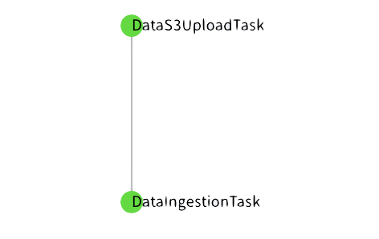

# Clasificación de inspecciones realizadas a establecimientos de comida en la ciudad de Chicago.

Un proyecto de punta a punta realizado en la materia de _Data Product Architecture_. 

## Contenidos

1. [Proyecto](#proyecto)
   1. [Integrantes del equipo](#integrantes-del-equipo)
   1. [Descripción de los datos](#descripción-de-los-datos)
   1. [Pregunta analítica a contestar](#pregunta-analítica-a-contestar-con-el-modelo)
   1. [Frecuencia de actualización de los datos](#frecuencia-de-actualización-de-los-datos)
1. [Configuración](#configuración)
   1. [Python y requerimientos](#python-y-requerimientos)
   1. [Notebooks](#notebooks)
   1. [Credenciales](#credenciales)
   1. [Constantes](#constantes)
1. [Estructura del proyecto](#estructura-del-proyecto)
1. [Orquestación](#orquestación)
   1. [DataS3UploadTask](#datas3uploadtask)
   1. [DataIngestionTask](#dataingestiontask)
1. [Proceso de ingesta manual](#proceso-de-ingesta-manual)
   1. [Ingesta histórica](#ingesta-histórica)
   1. [Ingesta consecutiva](#ingesta-consecutiva)
   1. [Uso de datos almacenados en S3](#uso-de-datos-almacenados-en-s3)
   
## Proyecto

### Integrantes del equipo:

* [José Antonio Lechuga Rivera](https://github.com/lechugaa)
* [Carlos Bautista](https://github.com/cbautistap)
* [Mario Arturo Heredia Trejo](https://github.com/mhnk77)
* [Enrique Ortiz Casillas](https://github.com/EnriqueOrtiz27)


### Descripción de los datos

La base de datos con la que trabajamos contiene información respecto a las inspecciones 
a restaurantes y a otros establecimientos de comida en la ciudad de Chicago del primero
de enero de 2010 a la fecha actual. (Los datos se encuentran en [este link](https://data.cityofchicago.org/Health-Human-Services/Food-Inspections/4ijn-s7e5))

**Información general de la base de datos:** 

* 215,000 renglones (cada fila es una inspección realizada)
* 17 columnas

Las columnas contienen información acerca del establecimiento inspeccionado así como del
resultado de la inspección. Las siguientes son algunas de las variables disponibles en el
conjunto de datos:

* Nombre del establecimiento inspeccionado
* Número de licencia del establecimiento
* Tipo de establecimiento
* Riesgo de la categoría del establecimiento
* Dirección del establecimiento
* Fecha de la inspección
* Tipo de inspección
* Resultados
* Violaciones al reglamento


### Pregunta analítica a contestar con el modelo.

La pregunta a contestar es la siguiente: 

_Dadas las características de este establecimiento, ¿pasará o no pasará la inspección?_

Es decir, este es un problema de clasificación en donde intentaremos determinar, a partir de 
características generales de un establecimiento, si podrá o no cumplir con los estándares de salubridad
requeridos para pasar una inspección.

### Frecuencia de actualización de los datos.

Los datos se actualizan diariamente. Sin embargo, los _pipelines_ de este proyecto corren de forma
semanal.

## Configuración

### Python y requerimientos

Este proyecto está programado y probado usando python 3.7.4. En el directorio raíz se encuentra
un archivo llamado `requirements.txt` que contiene todas las dependencias necesarias para ejecutar
satisfactoriamente el proyecto. Para instalarlas usar el siguiente comando:

```
pip install -r requirements.txt
```

### Notebooks

Para poder correr los Jupyter notebooks se debe adicionar el csv de datos de inspecciones de la 
ciudad de Chicago con el nombre `Food_Inspections.csv` dentro del directorio `data`.

### Credenciales

Para conectarse programáticamente a AWS y a la API del set de datos debe de existir un archivo de configuraciones en 
la ruta `conf/local/credentials.yaml`. La estructura del este archivo debe ser la siguiente:

```
---
s3:
  aws_access_key_id: SU_AWS_ACCESS_KEY_ID
  aws_secret_access_key: SU_AWS_SECRET_ACCESS_KEY

food_inspections:
  api_token: SU_APP_TOKEN_DE_CHICAGO_API
...
```

### Constantes

Para poder ejecutar el proyecto satisfactoriamente, es importante personalizar algunas de las constantes que se usan
a lo largo del pipeline y que se encuentran en `src.utils.constants.py`. Las que se deben modificar se enlistan a 
continuación:

* `bucket_name`: esta debe ser modificada por el nombre de un bucket de S3 al que usted tenga acceso desde las 
  credenciales de AWS que configuro en el paso anterior.


## Estructura del proyecto

Esta es la estructura del proyecto incluyendo notebook del EDA llamado `eda.ipynb`.

```
├── README.md                           <- The top-level README for developers using this project.
├── conf
│   ├── base                            <- Space for shared configurations like parameters
│   └── local                           <- Space for local configurations, usually credentials
│       └── credentials.yaml            <- Required credentials for connecting to AWS
├── data                                <- Space for temporary csv files required for testing and EDA
│
├── docs                                <- Space for Sphinx documentation
│
│
├── img                                 <- Images used for README.md
├── notebooks                           <- Jupyter notebooks.
│   ├── legacy                          <- Jupyter notebook drafts
│   ├── shapefiles                      <- Shapefiles and geojson required for graphing purposes
│   └── eda.ipynb                       <- Iniital EDA and GEDA for project
│   
├── references                          <- Data dictionaries, manuals, and all other explanatory materials.
│
├── results                             <- Intermediate analysis as HTML, PDF, LaTeX, etc.
│
├── requirements.txt                    <- The requirements file
│
├── .gitignore                          <- Avoids uploading data, credentials, outputs, system files etc
│
├── infrastructure
├── sql
├── setup.py
├── temp                                <- Temporal storage for general use in the project
└── src                                 <- Source code for use in this project.
    ├── __init__.py                     <- Makes src a Python module
    │
    ├── utils                           <- Functions used across the project
    │   ├── general.py                  <- Obtención de credenciales de AWS
    │   └── constants.py                <- Definición de constantes del proyecto
    ├── etl                             <- Scripts to transform data from raw to intermediate
    │
    │
    ├── pipeline
    │    └── ingesta_almacenamiento.py   <- ingesta datos desde API y almacenamiento en S3
    │
    └── orchestration                    <- Luigi task definitions used across the project
         ├── data_ingestion_task.py      <- Luigi task for downloading data from the Chicago Food Inspections API
         └── data_s3_upload_task.py      <- Luigi task for uploading a a file that exists in ./temp to S3
```

## Orquestación

El proyecto actualmente cuenta con dos tasks de orquestación. A continuación se muestra el DAG de Luigi:



### DataS3UploadTask

Esta tarea requiere la ejecución de:
* DataIngestionTask

Se encarga de subir un archivo pickle contenido en la carpeta `temp` al bucket de S3 que se encuentra
configurado en el proyecto a través de `src.utils.constants.py` y el archivo `conf.local.credentials.yaml`. El uso
es el siguiente:

```
PYTHONPATH='.' luigi --module 'src.orchestration.data_s3_upload_task' DataS3UploadTask [--local-scheduler] [--historic] [--query-date <YYYY-MM-DD>]
```

* `--historic`: si se incluye este argumento se realizará la ingesta histórica, mientras que si se omite se realizará 
  una ingesta continua   
* `--query-date`: se debe agregar la fecha de ingesta deseada en formato YYYY-MM-DD. Si se omite este argumento, se
   utilizará la fecha del día de ejecución en el código.
  
El resultado final de esa tarea es subir un archivo contenido en `temp` a la ruta correspondiente en un bucket de S3.

### DataIngestionTask

Esta tarea se encarga de obtener los datos de la API de Chicago Food Inspections ya sea histórica a continua. El uso
es el siguiente:

```
PYTHONPATH='.' luigi --module 'src.orchestration.data_ingestion_task' DataIngestionTask [--local-scheduler] [--historic] [--query-date <YYYY-MM-DD>]
```

* `--historic`: si se incluye este argumento se realizará la ingesta histórica, mientras que si se omite se realizará 
  una ingesta continua   
* `--query-date`: se debe agregar la fecha de ingesta deseada en formato YYYY-MM-DD. Si se omite este argumento, se
   utilizará la fecha del día de ejecución en el código.
  
El resultado final de esta tarea es colocar un archivo pickle con los datos consultados de la API de Chicago en la 
carpeta `temp`.

## Proceso de ingesta manual

Para poder llevar a cabo este procedimiento, asegúrese de tener el documento de `credentials.yaml` tal cual se indica
en la sección de *Credenciales*. 

Para el bucket de S3 se utilizará una constante definida en 
`src/utils/constants.py` sin embargo, para uso externo no es posible utilizar esta constante sin modificarla,
ya que, el bucket empleado en el proyecto no tiene acceso público. Por ello la variable `bucket_name`, debe
ser modificada por el nombre de un bucket que usted pueda acceder a partir de sus credenciales de AWS que se 
encuentran en el archivo de credenciales mencionado.

### Ingesta histórica

Al encontrarse en el directorio raíz del proyecto, ejecutar las siguientes instrucciones:

1. Importar las funciones y constantes necesarias para la ingesta histórica
    ```
    from src.pipeline.ingesta_almacenamiento import get_client, ingesta_inicial, get_s3_resource, guardar_ingesta
    from src.utils.constants import bucket_name
    from src.utils.general import get_upload_path
    ```
   
2. Obtener el cliente que permite conectarse a la API de datos de la Ciudad de Chicago
    ```
    client = get_client()
    ```
   
3. Obtener las observaciones históricas hasta la fecha de búsqueda de la API de inspecciones de comida en la
Ciudad de Chicago
   ```
   results_ingesta_inicial = ingesta_inicial(client=client)
   ```
   **Nota:** esta función usa por default el parámetro `limit` con valor de `300,000`, pero es posible llamarla
   modificando dicho parámetro en caso de la ingesta histórica implique más observaciones en un futuro. Adicionalmente, 
   se puede proveer un parámetro `query_date` con un dato de tipo `datetime` para especificar la fecha a partir de la 
   cual se quiere recolectar datos hacia atrás. En caso de no suministrarla, como en el ejemplo, la función obtendrá 
   todas las observaciones de la base de datos hasta el día de ejecución. Este es el comportamiento buscado para el 
   proyecto por lo que en general se llamará sin este parámetro y solamente una ocasión.
   
4. Obtener los recursos de S3 de las credenciales de AWS
    ```
    s3_resource = get_s3_resource()
    ```

5. Obtener la ruta donde se deben guardar los datos en el bucket
    ```
    bucket_path = get_upload_path(historic=True)
    ```
    Nota: esta función le devuelve la ruta correcta de acuerdo al día que se llamó. Ejemplo:
   `ingestion/initial/historic-inspections-2021-02-22.pkl`
   
6. Guardado de la ingesta en el bucket de S3
    ```
    guardar_ingesta(bucket_name=bucket_name, 
                    bucket_path=bucket_path, 
                    data=results_ingesta_inicial, 
                    s3_resource=s3_resource)
    ```
   **Nota:** recuerde que la variable `bucket_name` debe ser sustituida por el nombre de un bucket al que usted tenga
   acceso.
   
### Ingesta consecutiva

Al encontrarse en el directorio raíz del proyecto, ejecutar las siguientes instrucciones:

1. Importar las funciones y constantes necesarias para la ingesta consecutiva
    ```
    from src.pipeline.ingesta_almacenamiento import get_client, ingesta_consecutiva, get_s3_resource, guardar_ingesta
    from src.utils.constants import bucket_name
    from src.utils.general import get_upload_path
    ```

2. Obtener el cliente que permite conectarse a la API de datos de la Ciudad de Chicago
    ```
    client = get_client()
    ```
   
3. Obtener las observaciones históricas hasta la fecha de búsqueda de la API de inspecciones de comida en la
Ciudad de Chicago
   ```
   results_ingesta_consecutiva = ingesta_consecutiva(client=client)
   ```
   **Nota:** esta función usa por default el parámetro `limit` con valor de `1,000`, pero es posible llamarla
   modificando dicho parámetro en caso de la ingesta consecutiva implique más observaciones en un futuro. 
   Adicionalmente, se puede proveer un parámetro `query_date` con un dato de tipo `datetime` para especificar
   la fecha a partir de la cual se quiere recolectar datos. En caso de no suministrarla, como en el ejemplo,
   la función calculará la fecha de 7 días atrás con respecto al día que se ejecuta. Este es el comportamiento
   buscado para el proyecto por lo que en general se llamará sin este parámetro.
   
4. Obtener los recursos de S3 de las credenciales de AWS
    ```
    s3_resource = get_s3_resource()
    ```

5. Obtener la ruta donde se deben guardar los datos en el bucket
    ```
    bucket_path = get_upload_path(historic=False)
    ```
    Nota: esta función le devuelve la ruta correcta de acuerdo al día que se llamó. Ejemplo:
   `ingestion/consecutive/consecutive-inspections-2021-02-22.pkl`
   
6. Guardado de la ingesta en el bucket de S3
    ```
   guardar_ingesta(bucket_name=bucket_name, 
                   bucket_path=bucket_path, 
                   data=results_ingesta_consecutiva, 
                   s3_resource=s3_resource)
    ```
   **Nota:** recuerde que la variable `bucket_name` debe ser sustituida por el nombre de un bucket al que usted tenga
   acceso.
   
### Uso de datos almacenados en S3

Los datos se almacenan en formato pickle en S3, correspondiendo a un JSON. Para poder usarlos como un dataframe de 
pandas se recomienda usar el siguiente bloque de código para evitar conflictos una vez que ya se descargó de S3:

```
import pandas as pd

ingestion_df = pd.DataFrame.from_dict(ingestions_pkl)
```
